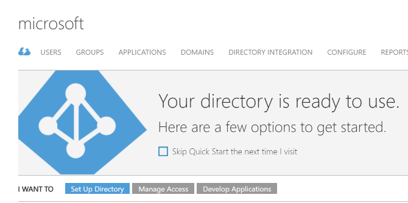
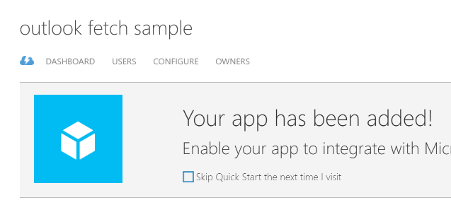
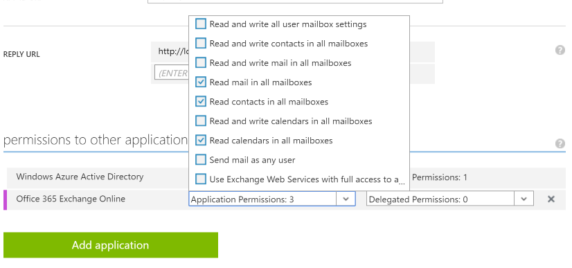

# Outlook Fetch Command Line Sample

If you'd like to create this app from scratch using step-by-step instructions, see [the tutorial](./tutorial.md).

To run this example, you need to create an app registration and update the code with your client ID and authorization URL.

## Registering the app

In order to use the client credentials flow, the Outlook APIs require that you use a certificate for app authentication, rather than a client secret. Before we create the app registration in Azure, we'll start by creating a certificate.

> As of this writing, the Azure v2.0 endpoints do not support the client credentials flow. So in order to use this flow, we need to register the app in the Azure Management portal and use the v1 token endpoint.

### Create the certificate

The certificate must have a key length of at least 2048 bits, but it can be a self-issued certificate. On Windows, we can use the **makecert.exe** tool that's included with Visual Studio to create a certificate.

> If makecert.exe is not on your PATH in a normal command prompt, you can open the **Developer Command Prompt for VS2015** and run the commands from there.

1. From a command prompt, enter the following command, which creates the certificate in the current user's personal certificate store.

  ```Shell
  makecert -r –pe -n "CN=Outlook Fetch Sample Cert" –ss my –len 2048
  ```

1. Find the certificate in the user's personal certificate store in the Certificates MMC snap-in.

  1. Press **Windows key + R**, then type `mmc` and hit enter.
  1. On the **File** menu, choose **Add/Remove Snap-in**.
  1. Select the **Certificates** snap-in and click **Add**.
  1. Choose **My user account** and click **Finish**.
  1. Click **OK**.
  1. Expand the **Certificates - Current User** item in the left-hand list.
  1. Expand **Personal**, then select **Certificates**.
  1. Locate the **Outlook Fetch Sample Cert** entry in the list and select it.

1. Export the certificate with the private key. The app will need the private key to sign token requests.

  1. On the **Action** menu, choose **All Tasks**, then **Export**.
  1. On the Welcome screen, click **Next**.
  1. Choose **Yes, export the private key** and click **Next**.
  1. Make sure **Personal Information Exchange - PKCS #12 (.PFX)** is selected and click **Next**.
  1. Choose **Password** and enter a strong password. Click **Next**.
  1. Choose a location and file name and click **Next**. In this example we'll call this file `outlook-fetch-priv.pfx`.
  1. Click **Finish**.

1. Export the certificate without the private key. We'll need this to attach to our app registration so Azure can use it to verify the app's signed token requests.

  1. Make sure you still have the **Outlook Fetch Sample Cert** selected.
  1. On the **Action** menu, choose **All Tasks**, then **Export**.
  1. On the Welcome screen, click **Next**.
  1. Choose **No, do not export the private key** and click **Next**.
  1. Choose **Base-64 encoded X.509 (.CER)** and click **Next**.
  1. Choose a location and file name and click **Next**. In this example we'll call this file `outlook-fetch-pub.cer`.
  1. Click **Finish**.

### Create the app registration

In this step we'll create an app registration in the Azure Active Directory associated with your Office 365 tenant. You'll need the credentials for an organizational administrator, and you'll need an Azure subscription associated with your Office 365 tenant. Instructions for associating an Azure subscription with Office 365 can be [found on MSDN](https://msdn.microsoft.com/office/office365/howto/setup-development-environment#bk_CreateAzureSubscription).

1. Browse to https://manage.windowsazure.com and sign in as an organizational administrator.

1. In the **all items** list, choose your **Directory** entry.

1. In the navigation menu at the top, choose **APPLICATIONS**.

  

1. On the bottom toolbar, choose **ADD**.

  

1. Choose **Add an application my organization is developing**.

1. Enter `Outlook Fetch Sample` for the name.

1. Make sure that **WEB APPLICATION AND/OR WEB API** is selected. Even though the app we are creating will be a console app, we still need to select this type. Click the **Next** button.

1. Enter `http://localhost` for the **SIGN-ON URL**.

1. Enter `https://<your Office 365 domain>/outlook-fetch` for the **APP ID URI**, replacing `<your Office 365 domain>` with your Office 365 domain. For example: `https://contoso.onmicrosoft.com/outlook-fetch`. Click the **Complete** button.

1. In the navigation menu at the top, choose **CONFIGURE**.

  

1. Locate the **CLIENT ID**. Copy this value and replace the `YOUR CLIENT ID` value in **Program.cs** with it.

1. Locate the **permissions to other applications** section. Click **Add application**.

1. Choose **Office 365 Exchange Online** and click the **Complete** button.

1. There should now be an entry for **Office 365 Exchange Online** in the **permissions to other applications** section. In the **Application Permissions** dropdown, select **Read mail in all mailboxes**, **Read contacts in all mailboxes**, and **Read calendars in all mailboxes**.

  

1. In the bottom toolbar, click **SAVE**. Wait for the update to complete.

1. In the bottom toolbar, click **MANAGE MANIFEST**, then choose **Download Manifest**. Save the manifest in the same directory as your certificate files, and rename it to `appmanifest.json`.

### Upload public key to the app registration

In this step we'll insert the public key we exported earlier into the app manifest we downloaded, then upload the modified manifest back to Azure.

1. Download the [Get-KeyCredentials.ps1](./certificate/Get-KeyCredentials.ps1) file and save it in the same directory as your certificate files.

1. Open **Windows Powershell** in the directory where you saved your certificate files.

1. Run the following command: 

  ```Shell
  .\Get-KeyCredentials.ps1 .\outlook-fetch-pub.cer
  ```

1. Open the `keyCredentials.txt` file and verify that values were generated. It should look similar to this (values truncated):

  ```JSON
  "keyCredentials": [
    {
      "customKeyIdentifier": "Vr3TRhO85mjjJevziQrBk2nQnpE=",
      "keyId": "79a41b2e-85d1-49a2-8a81-d378b0eb8f9a",
      "type": "AsymmetricX509Cert",
      "usage": "Verify",
      "value": "MIIDKzCCAhOgAwIBAgIQ...1iukV2yc52g="
    }
  ],
  ```

1. Open the `appmanifest.json` file in a text editor. Locate the `keyCredentials` value:

  ```JSON
  "keyCredentials": [],
  ```

1. Replace the `keyCredentials` line in `appmanifest.json` with the entire contents of the `keyCredentials.txt` file. Save the file.

1. In the Configure page for the app registration in Azure Management Portal, click the **MANAGE MANIFEST** button and choose **Upload Manifest**. Browse to `appmanifest.json` and click **OK** to upload the updated manifest.

1. Before leaving the Azure Management Portal, click the **VIEW ENDPOINTS** button in the bottom toolbar. Copy the value of **OAUTH 2.0 AUTHORIZATION ENDPOINT** and replace the `YOUR AUTHORIZATION ENDPOINT` value in **Program.cs** with it.

## Run the app

Save your changes and run the app to see the command line arguments.
